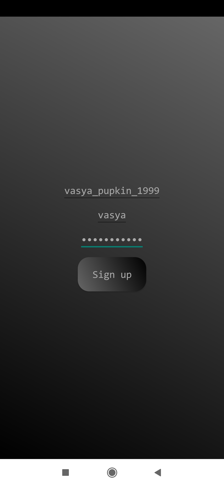

# ClientBullfinchMail

## Текст программы: [Server](https://github.com/vasilievan/ServerBullfinchMail), [Client](https://github.com/vasilievan/ClientBullfinchMail)

## Общие сведения
В приложении реализована клиент-серверная архитектура. Обе части были написаны на языке *Kotlin* (v. 1.3.71). Главной задачей было обеспечить высокую надежность хранения данных пользователей, что и было реализовано на всех уровнях приложения.

## Клиентская часть
В клиентской части реализован паттерн *Model-View-Controller* (*MVC*). Это приложение с графическим интерфейсом, написанное для операционной системы *Android OS*, *minSDK* = 23 (*Marshmallow*), *compileSDK* = 29 (*Android Q*). Глобально приложение состоит из 2 пакетов: *model* и *view*. Пакет *model*, в свою очередь, подразделен еще на 4 пакета. Для облегчения вычислений на сервере и снижения нагрузки, все проверки корректности имени пользователя, логина, пароля сообщения и т.д. совершаются на клиентской стороне. Для лучшей читаемости и защиты глаз пользователя приложение сделано в тёмной теме, использован привычный программистам шрифт *Consolas*. Ориентация экрана вертикальная.

### Пакет model
Содержит пакеты, описывающие логику приложения.

#### Пакет autostart
Содержит класс **Autostart**, представляющий собой *BroadcastReceiver*. Этот класс при включении устройства запускает сервис **UpdatesChecker** из пакета *updates*, который с интервалом в 5 с проверяет наличие новых сообщений и заявок в друзья у сервера. Т.к. *Android* “убивает” сервисы, работающие продолжительное время, создается *AlarmManager* – системный “будильник”, который каждый 10 минут запускает сервис **UpdatesChecker**, если тот не работает.

#### Пакет general
Содержит разделяемую логику, общую для многих классов приложения.
Класс **Constants** содержит константы, используемые в приложении, например, доступные порты для соединения, используемые алгоритмы для шифрования и т.д.; кроме констант, используемых протоколом.
Следующий класс из этого пакета – **DataBase**. Он позволяет организовать работу с данными. Полученные сообщения от других пользователей хранятся в незашифрованном виде в формате *JSON* в папке *messages*. Там же хранятся отправленные сообщения. Имя файла – его порядковый номер в списке всех сообщений переписки с данным пользователем (0, 1, 2…). Это позволяет легко и нересурсозатратно вывести всю переписку на экран пользователя. Сообщения имеют следующую структуру: дата отправки, содержание сообщения и “гравитация” – принцип отображения сообщения на графическом интерфейсе в зависимости от отправителя (слева или справа на экране).
Кроме того, класс **DataBase** обслуживает работу с ключами, открытым и закрытым. Пользователи при общении между собой используют “удлинённые ключи” по сравнению с серверными: ключ – простое число, большее 2^2048. Это гарантирует еще большую надежность при обмене сообщениями.
Кроме того в папке с логином клиента содержится файл *extras.json*, в котором содержится имя пользователя, полученное при первом обмене ключами.
Логин, пароль, имя пользователя хранятся в зашифрованном виде в *EncryptedSharedPreferences* в области памяти, недоступной напрямую пользователю.
 
Структура клиентской базы данных представлена ниже:

Рис 1.1 - Структура базы данных клиента.

Рассмотрим следующий класс – **GlobalLogic**. В нем находится наиболее общая логика, используемая многими классами приложения: запрос необходимых для работы приложения разрешений, проверка наличия интернет-соединения, чтение из буфера, отправка данных в буфер и т.д.
Интерфейс **Normalizable** предназначен для наследников класса *AppCompatActivity*. Он позволяет создать кастомный шрифт из ресурсов и применить его ко всем *View* на данной *Activity*.
Класс **ProtocolPhrases** аналогичен одноименному классу из серверной части приложения. В нем содержатся константы, используемые непосредственно для протокола общения сервера с клиентом.

#### Пакет specific
Содержит специфичную логику.
Класс **ConversationLogic** является вспомогательным классом для **Conversation**. В нём находятся методы для нормализации отображения сообщения на экране мобильного устройства и проверки корректности формата отправленного сообщения.
Класс данных **Dialog** является объектом, структурно представляющим собой переписку с пользователем. В нем есть поле *userName*, имя пользователя, с которым ведется диалог.
**DialogAdapter** – один из служебных классов приложения, используемый для вывода большого количества переписок на *Activity* **Profile** посредством *RecyclerView*.
Класс **DialogsHolder** позволяет преобразовывать шаблонную заготовку с переписками, подставляя в нее имена, меняя шрифт и т.д. для дальнейшего выведения на экран.
Класс данных **Message** является объектом, структурно представляющим собой сообщение. В нем есть поле *date*, дата отправки, *content* – содержание сообщения и *gravity* – левое/правое выравнивание.
**MessageAdapter** – один из служебных классов приложения, используемый для вывода большого количества переписок на *Activity* **Conversation** посредством *RecyclerView*.
Класс **MessagesHolder** позволяет преобразовывать шаблонную заготовку с сообщенияем, подставляя в нее дату отправки, содержание и выравнивание для вывода на экран пользователя.
В классе **ProfileLogic** находится метод, создающий диалоговое окно для ввода нового имени пользователем при смене имени.
**RegistrationLogic** содержит все методы, так или иначе предназначенные для работы с сетью: отправка сообщения, авторизация, регистрация, обмен ключами с сервером и клиентом, проверка на корректность сообщений, логина и др.
Класс **SplashscreenLogin** является своеобразным “навигатором”. Если пользователь входит в систему впервые, он перенаправляется в окно регистрации, иначе – открывается профиль пользователя.

#### Пакет updates
Содержит класс **UpdatesChecker**, упомянутый ранее. Этот класс расширяет класс **Service**, постоянно работает в фоновом процессе. Каждые 5 секунд обращается к серверу, чтобы запросить обновления по заявкам в друзья и сообщениям. Если хотя бы что-то из этого обновилось, он посылает “намерение” по обновлению графического интерфейса, а также выводит уведомление в строку уведомлений мобильного устройства.
На этом суперпакет *model* заканчивается, переходим к пакету *view*.

### Пакет view
Содержит классы, расширяющие *AppCompatActivity*, т.е. представляющие собой графический интерфейс приложения.
Класс **SplashScreen** является “переходом”, “трансфером” в приложении. Он выводит на экран логотип приложения, снегиря, несущего в клюве письмо. И перенаправляет либо на регистрацию, либо на профиль приложения.

Рис 1.2 - **Splashscreen** скриншот.

Если пользователь не зарегистрирован, открывается класс **Registration** с тремя полями для ввода: *User name* – имя пользователя, которое будет отображаться в его профиле и профилях его друзей, *Login* – уникальное имя, по которому пользователя можно найти, а также по которому проходит авторизация для совершения любого действия, будь то смена имени или отправка сообщения или заявки в друзья, *Password* – пароль пользователя. Символы поля пароля привычно скрываются при наборе. Регистрация совершается по нажатии на кнопку *Sign up*.
В случае успешной регистрации пользователь будет оповещён с помощью *Toast* и перенаправлен в класс **Profile**.  Аналогично если регистрация прошла безуспешно и сервер не ответил по каким-то причинам, пользователь будет об этом оповещён и никуда не будет перенаправлен.

Рис 1.3 - **Registration** скриншот до ввода данных.

Рис 1.4 - **Registration** скриншот после ввода данных.

Если же зарегистрирован, открывается класс **Profile** с именем пользователя в заголовке, полем *Find user by username*, предназначенным для отправки заявки в друзья. Заявка отправляется по нажатии клавши перехода на новую строку. Если бы у пользователя были контакты, они бы динамически вывелись на экран, как показано на Рис. 1.6. При продолжительном нажатии по имени профиля, появляется диалоговое окно для смены *username*, как показано на Рис. 1.7.
При удачной смене пользовательского имени, оно динамически обновится на *Activity*, пользователь будет об этом оповещён.
При успешной отправке заявки в друзья, диалог с новым пользователем появится под надписью *Conversations*, пользователь будет оповещён; как и об ошибках.
Новые диалоги динамически появляются на *Activity*.

Рис 1.5 - **Profile** скриншот сразу после регистрации.

Рис 1.6 - **Profile** скриншот когда появились контакты.

Рис 1.7 - **Profile** скриншот смены имени пользователя.

По нажатии на один из диалогов открывается класс **Conversation**. Если ещё не было никаких сообщений, он выглядит как на Рис. 1.8. Если есть, как на Рис. 1.9. В поле *Print your message here* надо написать сообщение и нажать на кнопку перехода на новую строку.
Если сообщение отправлено, оно появится на *Activity*. Иначе ничего не произойдет.
Новые сообщения динамически появляются на *Activity*.

Рис 1.8 - **Conversation**, сообщений еще нет.

Рис 1.9 - **Conversation**, сообщения есть.

Клиентская часть протестирована с помощью библиотеки *JUnit*. Особое внимание было уделено работе с файловой системой: записи данных (ключей, сообщений) и чтения оных; проводилось на *AVD* симуляторе, встроенном в среду разработки. Результат работы совпал с ожидаемым. Были отправлены и получены тестовые сообщения.

